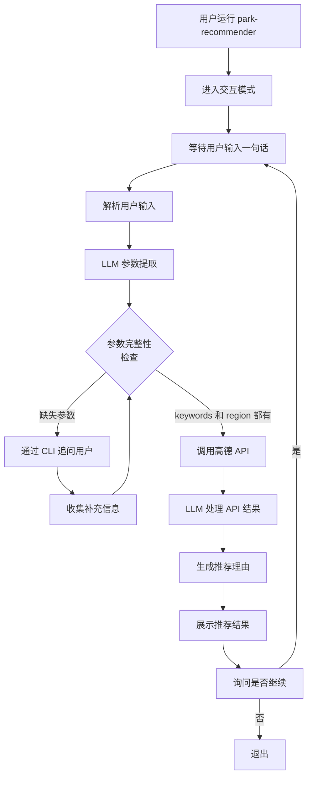

## 用户需求

### 核心流程改进

用户运行 `park-recommender` 命令后直接进入交互命令行（无需 rec 参数），通过一句自然语言输入完整的推荐需求。系统通过 LLM 智能提取高德 API 所需的参数，判断参数完整性，缺失时通过命令行交互追问，参数齐全后直接调用高德 API 查询，最后由 LLM 处理返回数据并生成推荐结果。

### 流程说明

1. **直接交互入口**：用户运行 `park-recommender` 进入命令行，不需要子命令
2. **一句话输入**：用户输入"我住在深圳宝安西乡，帮我推荐附近有哪些公园"
3. **参数自动提取**：LLM 解析用户输入，提取高德 API 所需的 `keywords` 和 `region` 等参数
4. **参数完整性检查**：根据高德 API 的必需参数（keywords、region）判断

- 参数完整 → 直接调用高德 API 查询
- 参数缺失 → 通过命令行追问用户补充信息

5. **数据处理与推荐**：调用高德 API 获得公园列表后，由 LLM 处理数据、生成推荐理由，展示给用户

### 高德 API 参数

高德 POI 搜索的核心参数：

- `keywords`（必需）：搜索关键词，如"公园"
- `region`（必需）：搜索地区，如"深圳"或城市编码
- `types`（可选）：地点类型数组
- `pageSize`（可选）：每页返回数量，默认 10，最大 25
- `pageNum`（可选）：分页页码，默认 1

## 技术架构设计

### 总体方案

实现一个**参数提取与验证引擎**，让 LLM 从自然语言输入中提取高德 API 参数，并建立**动态交互反馈机制**来处理参数缺失的情况。系统将简化当前的多阶段对话流程，转变为"单句输入 → 参数提取 → 验证 → 补充 → 查询"的线性流程。

### 架构设计



### 核心模块

#### 1. 参数提取器（ParameterExtractor）

**职责**：从用户自然语言输入中提取高德 API 所需参数

- 使用 LLM 提取 `keywords`、`region` 等参数
- 返回提取的参数及缺失项列表
- 支持参数置信度评分

**关键方法**：

```
async extractParameters(userInput: string): Promise<ExtractedParams>
  - 返回：{ keywords?, region?, extracted: boolean, missingFields: string[] }
```

#### 2. 参数验证器（ParameterValidator）

**职责**：验证参数完整性，判断是否可以调用高德 API

- 检查必需参数（keywords、region）
- 生成缺失参数的提问文案

**关键方法**：

```
validateForMapQuery(params: Partial<MapSearchParams>): ValidationResult
  - 返回：{ isValid: boolean, missingFields: string[], prompts: string[] }
```

#### 3. 改进的 CLI 交互流程

**职责**：处理用户交互，集成参数提取与验证

- 替换现有的多阶段对话
- 支持动态追问缺失参数
- 集成 LLM 处理高德 API 结果

### 实现细节

#### 参数提取的 LLM 提示词

```
你是一个公园推荐助手。从用户的一句话中提取以下信息：
1. keywords：用户要搜索的内容（如"公园"、"山"、"景区"）
2. region：用户所在的地区或城市（如"深圳"、"深圳宝安"、"北京朝阳"）

用户输入：{userInput}

请返回 JSON 格式：{"keywords": "...", "region": "..."}
如果某项无法提取，返回 null。
```

#### 缺失参数的追问策略

- **缺少 keywords**：询问"你想搜索什么？(如：公园、景区、爬山路线)"
- **缺少 region**：询问"你在哪个城市或地区？"
- 同时缺少多个：逐个追问，每次一个参数

#### 高德 API 结果处理流程

1. 调用高德 API 获得 POI 列表（通常 10-20 个）
2. 使用 LLM 对结果进行语义理解和排序
3. 为每个推荐生成理由文案
4. 展示 Top N（3-5 个）推荐结果

### 性能考虑

- **缓存策略**：缓存同一地区的查询结果，避免重复调用高德 API
- **LLM 调用优化**：单次参数提取 + 结果处理，共 2 次 LLM 调用（最坏情况参数补充时会增加）
- **超时管理**：保持现有 5 分钟超时设置
- **并发控制**：使用现有的 RequestQueue 管理 API 请求

### 与现有架构的对齐

- **复用 DialogueManager**：保留 DialogueManager 的初始化和缓存机制
- **简化对话流程**：绕过多个 DialoguePhase，直接进入 QUERYING 阶段
- **复用 LLMEngine**：使用现有的 LLM 调用能力
- **复用 LocationService**：继续调用高德地图服务

## 推荐使用的扩展

### SubAgent: code-explorer

- **目的**：深入探索相关模块代码，了解 LLMEngine 的参数提取能力、DialogueManager 的缓存机制、以及 LocationService 的 API 调用模式
- **预期成果**：获取参数提取的既有实现、缓存键生成逻辑、以及 MapSearchParams 的验证规则