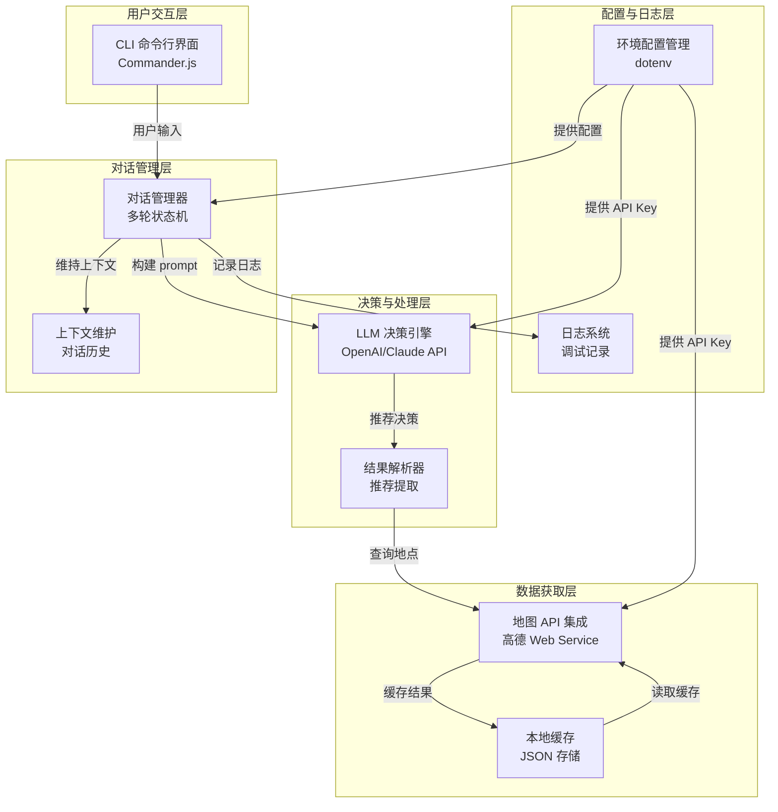

## 产品概览

为深圳用户构建一个 CLI Agent，通过多轮对话交互推荐公园和爬山景点。系统通过与用户的交互了解其偏好（如距离、难度、环境等），调用 LLM 进行智能决策，并整合地图 API 获取实时地点信息。

## 核心功能

1. **多轮对话交互**：通过命令行与用户进行多轮对话，逐步收集用户偏好信息（位置、距离、难度等）
2. **LLM 智能推荐**：使用 OpenAI/Claude API 进行推荐决策和自然语言理解
3. **地点数据集成**：通过高德地图 API 获取深圳公园和景点的实时信息（位置、距离、评分等）
4. **推荐结果展示**：以友好的 CLI 格式展示推荐结果，包括地点信息、路线建议等
5. **对话上下文管理**：维持多轮对话的上下文，支持后续追问和交互优化
6. **本地数据缓存**：缓存已查询的地点数据和用户交互历史，提高响应速度

## 交互流程

用户启动 CLI → Agent 初始化欢迎信息 → 询问用户位置/偏好 → Agent 调用 LLM 理解用户意图 → 查询地图 API 获取候选地点 → LLM 综合分析生成推荐 → 展示推荐结果 → 支持追问或新推荐

## 技术栈选择

### 核心技术栈

- **运行时**: Node.js 18+（支持 ESM 和现代 JavaScript 特性）
- **语言**: TypeScript（提供类型安全和开发效率）
- **CLI 框架**: Commander.js（命令定义、参数解析、交互管理）
- **LLM 集成**: OpenAI SDK 或 Anthropic SDK（支持 API 调用）
- **地图 API**: 高德地图 Web Service API（POI 搜索、距离计算）
- **HTTP 客户端**: axios（跨平台请求库）
- **环境管理**: dotenv（API Key 安全存储）
- **数据存储**: Node.js 原生 fs 模块 + JSON（本地缓存）
- **日志**: Winston 或 pino（日志记录和调试）

### 架构设计

#### 系统架构图



#### 模块划分

- **CLI 模块** (`src/cli/`): 命令定义、参数解析、交互入口
- **对话管理模块** (`src/dialogue/`): 多轮对话状态机、上下文管理、交互逻辑
- **LLM 模块** (`src/llm/`): LLM API 客户端、prompt 构建、结果解析
- **地图服务模块** (`src/map/`): 高德 API 集成、地点查询、距离计算
- **缓存模块** (`src/cache/`): 本地 JSON 存储、查询优化、过期管理
- **工具模块** (`src/utils/`): 类型定义、常量、辅助函数、日志配置
- **配置模块** (`src/config/`): 环境变量加载、API 配置验证

#### 核心数据流

1. 用户启动 CLI，输入推荐请求
2. CLI 模块解析命令，启动对话管理器
3. 对话管理器进入信息收集阶段，向用户询问位置、偏好等
4. 用户逐轮提供信息，对话管理器维持上下文
5. 当信息完整时，调用 LLM 进行推荐决策
6. LLM 分析用户偏好，返回搜索参数和推荐理由
7. 地图服务查询候选地点（优先检查缓存）
8. 结果解析器整理地点信息，生成推荐列表
9. CLI 以格式化输出展示推荐结果
10. 用户可追问或请求新推荐，循环对话

### 实现要点

#### 多轮对话状态管理

- 使用状态机管理对话阶段：`collecting_info` → `querying` → `recommending` → `completed`
- 维持完整对话历史和用户偏好上下文
- 支持会话持久化（可选本地存储，便于恢复对话）
- 智能判断何时信息足够，避免过度提问

#### LLM 提示词设计

- 为 LLM 设计系统角色提示（system prompt），定义 Agent 身份和职责
- 提供用户偏好背景和已收集信息，让 LLM 做出精准推荐
- 要求 LLM 返回结构化输出（JSON 格式），便于解析
- 设计多个 prompt 模板对应不同对话阶段

#### 地图 API 优化

- 实现两层缓存：内存缓存（本次会话）+ 磁盘缓存（跨会话）
- 缓存过期策略：地点信息保留 7 天，避免过期数据
- 批量查询地点，减少 API 调用次数
- 结果去重和排序，提高推荐质量

#### 错误处理策略

- API 超时重试机制（指数退避）
- 缓存降级：API 失败时使用本地缓存数据
- 友好的错误提示，引导用户重新输入
- 结构化日志记录异常，便于调试

#### 性能优化

- 异步处理 API 请求，避免阻塞 CLI
- 流式输出结果，实时反馈给用户
- 预加载深圳常见景点元数据，加快首次查询
- 压缩缓存数据，减少本地存储占用

### 架构扩展点

1. **LLM 供应商切换**：支持无缝切换 OpenAI、Claude、本地模型
2. **地图服务扩展**：可集成百度地图、腾讯地图等多个供应商
3. **推荐策略升级**：可添加用户评分学习、个性化排序等算法
4. **功能扩展**：支持路线规划、天气集成、门票信息等

## 设计策略

作为 CLI 应用，设计重点在于用户交互体验和信息呈现的清晰度。

### 交互设计

- **欢迎界面**：启动时显示简洁的欢迎信息和快速入门指南
- **对话流程**：清晰的问题提示，支持用户快速理解和回答
- **进度反馈**：长时间操作时显示加载指示，让用户了解系统状态
- **结果展示**：结构化表格展示推荐地点，包含关键信息（名称、距离、评分、难度）
- **交互帮助**：支持 `help` 命令查看所有可用操作，支持 `back` 回到上一步

### 视觉设计

- **配色方案**：
- 主色（强调）：青蓝色 `#00B4D8`（提示和重要信息）
- 成功色：绿色 `#06A77D`（推荐成功、完成）
- 警告色：黄色 `#FFB703`（提示用户注意事项）
- 错误色：红色 `#E63946`（错误消息）
- 中立色：灰色 `#6C757D`（辅助信息、分隔符）
- 背景：纯黑 `#000000`（终端默认背景）
- 文本：白色 `#FFFFFF`（主要文本）

- **字体和排版**：
- 标题（TITLE）：全大写，加粗强调，用 ASCII 艺术边框装饰
- 子标题（SECTION）：首字母大写加粗
- 内容文本：正常大小，易读
- 代码/关键词：使用 `[]` 或 `` ` `` 包围

- **UI 元素**：
- 分隔符：使用 `─` 或 `═` 区分不同板块
- 列表项：使用 `◆`, `▪`, `>` 等符号
- 提示文本：前缀 `[i]`（信息）、`[?]`（询问）、`[!]`（警告）、`[✓]`（成功）
- 加载动画：旋转或点点点 `...`

### 内容布局

#### 主界面

```
╔════════════════════════════════════════╗
║  🏞️  深圳公园景点推荐 Agent           ║
║      Park & Hiking Recommender        ║
╚════════════════════════════════════════╝

[i] 欢迎使用！我是你的深圳景点推荐助手。

[?] 请告诉我你的所在位置或地址：
```

#### 对话交互示例

```
[?] 你更喜欢哪种景点？
    > 公园 (P)
    > 爬山 (H)
    > 都可以 (B)
    
请选择 [P/H/B]: h
```

#### 推荐结果展示

```
[✓] 推荐完成！根据你的偏好，为你精选了以下景点：

┌─ 推荐结果 ─────────────────────────────────────┐
│ #1  梧桐山风景区                              │
│     距离: 3.2 km | 评分: ★★★★★ | 难度: 中等  │
│     特色: 城市登山 · 360°城市景观 · 生态保护区│
│     建议游玩: 2-3 小时                        │
│                                             │
│ #2  翠竹山公园                               │
│     距离: 1.5 km | 评分: ★★★★☆ | 难度: 简单 │
│     特色: 家庭友好 · 竹林古刹 · 休闲步道      │
│     建议游玩: 1-2 小时                       │
└─────────────────────────────────────────────────┘

[?] 需要帮助吗？
    [1] 了解更多详情     [2] 重新推荐
    [3] 查看路线规划     [4] 退出

请选择 [1-4]:
```

#### 详情页面

```
╔════════════════════════════════════════╗
║ 梧桐山风景区 - 详细信息                ║
╚════════════════════════════════════════╝

📍 地址: 深圳市罗湖区梧桐山社区
🌐 坐标: [114.2165, 22.5429]
📏 距你: 3.2 km（驾车约 12 分钟）

信息总览:
  • 评分: ★★★★★ (4.8/5.0)
  • 热度: 高 (82% 人气)
  • 难度: 中等 (建议体力: 7/10)
  • 海拔: 943 m

景点特色:
  • 城市登山绝佳去处
  • 360° 城市天际线景观
  • 生态保护区，自然风景优美
  • 步道设施完善

建议信息:
  • 游玩时间: 2-3 小时
  • 最佳季节: 秋冬季
  • 天气提示: 晴天游玩最佳
  • 携带物品: 登山鞋、防晒、饮用水

[?] 下一步？ [查看路线] [返回列表] [退出]
```

### 响应式设计

- 自动适配终端宽度，防止文本溢出
- 在小屏幕上优化表格显示（超长内容折行或省略号）
- 支持纵向和横向滚动（通过 `↑/↓` 键浏览长列表）

### 可访问性考虑

- 支持快捷键操作（1-9 数字选择，Enter 确认，ESC 返回）
- 提供清晰的错误提示和恢复指导
- 支持色盲模式（使用符号替代颜色区分）

## 推荐的代理扩展

### SubAgent

- **code-explorer**
- 用途：在项目初始化后，探索项目结构、依赖关系和现有代码模式，确保新实现符合项目约定
- 预期成果：快速定位项目结构、导入规范、类型定义位置，指导后续开发